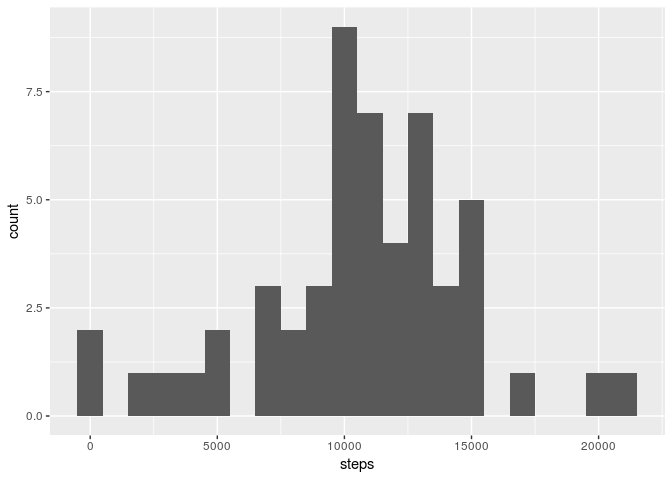
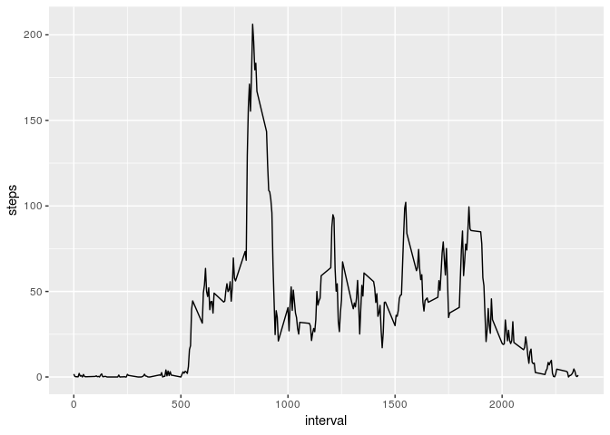
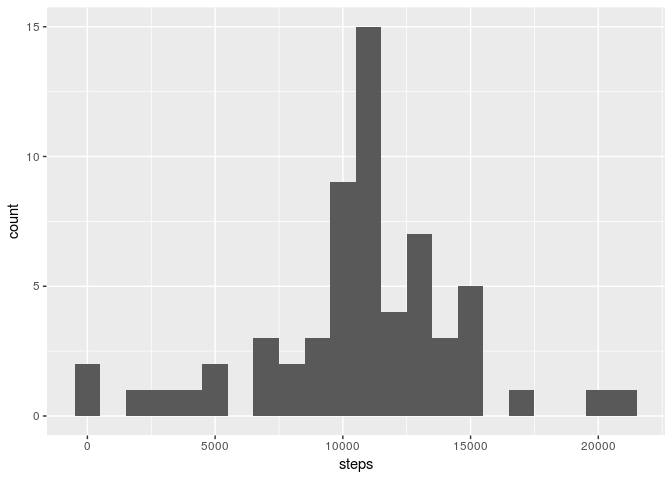
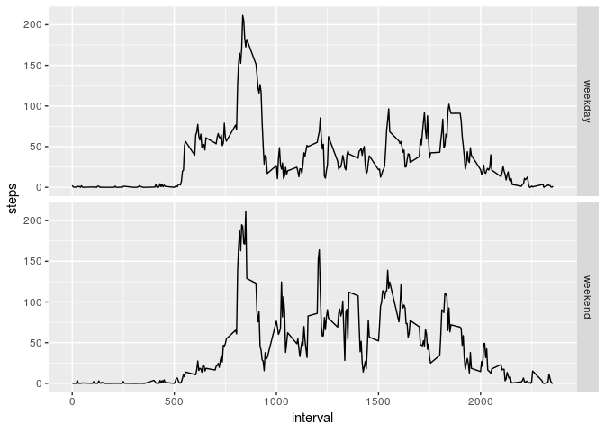

## Load required packages

If these packages are not already installed and you want to run the code,
please install them with `install.packages()`.


```r
library(dplyr)
library(ggplot2)
library(lubridate)
```

## Loading and preprocessing the data

Load the data using `read.csv()`. The values in the date column are converted
to Date-types.


```r
unzip("activity.zip")
data <- read.csv("activity.csv")
data <- data %>% mutate(date = ymd(date))
```

## What is mean total number of steps taken per day?

Calculate the total number of steps taken per day (missing values are ignored).


```r
total_steps <- data %>% group_by(date) %>% summarize(steps = sum(steps))
```

Show the total number of steps taken per day in a histogram (using the ggplot2
package).


```r
total_steps %>% filter(!is.na(steps)) %>%
    ggplot(aes(steps)) + geom_histogram(binwidth = 1000)
```

<!-- -->

Calculate the mean and median of the total number of steps taken per day.


```r
summary(total_steps$steps)[3:4]
```

```
##   Median     Mean 
## 10765.00 10766.19
```

## What is the average daily activity pattern?

Make a time series plot of the 5-minute interval (x-axis) and the average number
of steps taken, averaged across all days (y-axis).


```r
mean_steps <- data %>%
    group_by(interval) %>%
    summarize(steps = mean(steps, na.rm = TRUE))

mean_steps %>% ggplot(aes(interval, steps)) + geom_line()
```

<!-- -->

Which 5-minute interval, on average across all the days in the dataset, contains
the maximum number of steps?


```r
mean_steps[[which.max(mean_steps$steps),"interval"]]
```

```
## [1] 835
```

## Imputing missing values

Calculate and report the total number of missing values in the dataset (i.e. the
total number of rows with NAs).


```r
sum(!complete.cases(data))
```

```
## [1] 2304
```

Use the mean of each 5-minute interval to impute missing values. First the
previously created data frame `mean_steps` is joined with `data` and assigned
to a temporary variable `tmp`. Then, the NA-values for `steps.x` are replaced
with the value of `steps.y` (the average for the 5-minute interval).


```r
tmp <- data %>% left_join(mean_steps, by = "interval")
incomplete = is.na(tmp$steps.x)
tmp[incomplete,"steps.x"] <- tmp[incomplete,"steps.y"]
```

Create a new dataset that is equal to the original dataset but with the missing
data filled in.


```r
data_imputed <- tmp %>% mutate(steps = steps.x) %>% select(names(data))
```

Make a histogram of the total number of steps taken each day.


```r
total_steps_imputed <- data_imputed %>%
    group_by(date) %>%
    summarize(steps = sum(steps))
total_steps_imputed %>%
    ggplot(aes(steps)) + geom_histogram(binwidth = 1000)
```

<!-- -->

Calculate and report the mean and median total number of steps taken per day.


```r
summary(total_steps_imputed$steps)[3:4]
```

```
##   Median     Mean 
## 10766.19 10766.19
```

As we can see, imputing the missing values as described above has little
impact on the estimates of the total daily number of steps.

## Are there differences in activity patterns between weekdays and weekends?

Create a new factor variable in the dataset with two levels – "weekday"
and "weekend" indicating whether a given date is a weekday or weekend day.


```r
data_imputed <- data_imputed %>%
    mutate(type = if_else(wday(date) %in% c(1,6), "weekend", "weekday")) %>%
    mutate(type = as.factor(type))
```

Make a panel plot containing a time series plot of the 5-minute interval
(x-axis) and the average number of steps taken, averaged across all weekday days
or weekend days (y-axis).


```r
data_imputed %>% group_by(interval, type) %>%
    summarize(steps = mean(steps)) %>%
    ggplot(aes(interval, steps)) + geom_line() + facet_grid(type ~ .)
```

<!-- -->
